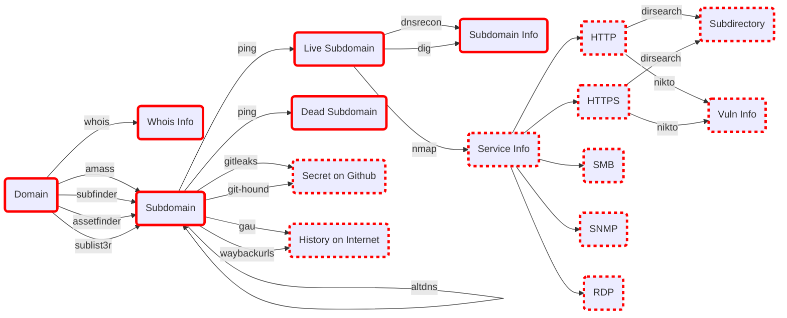

# Recon-Pocket

## Flow Chart




## Run It

> This project is still under construction.

> All commands are still being tested.

### Terminal First

```bash
sudo su
cd ~/recon-pocket
export target="target.com"

docker compose -f ./docker-compose.viewer.yml up
```

### Terminal Second

```bash
sudo su
cd ~/recon-pocket
export target="target.com"

docker compose -f ./docker-compose.whois.yml up

docker compose -f ./docker-compose.find_subdomain.yml up
chmod +x ./subdomain.sh && ./subdomain.sh
cp ./treasure/subdomain.txt ./altdns/

docker compose -f ./docker-compose.mutate.yml up
chmod +x ./subdomain_live.sh && ./subdomain_live.sh
cp ./treasure/subdomain_live.txt ./dnsrecon/
cp ./treasure/subdomain_live.txt ./dig/

docker compose -f ./docker-compose.dns_info.yml up
```

## On Board

### Tools

- [X] amass
- [X] subfinder
- [X] assetfinder
- [X] altdns
- [X] sublist3r
- [X] dnsrecon
- [ ] dirsearch
- [ ] httpx
- [ ] httprob
- [ ] waybackurls
- [ ] gau
- [ ] git-hound
- [ ] gitleaks
- [ ] naabu
- [ ] gf
- [ ] gf-templetes
- [ ] nuclei
- [ ] nuclei-templets
- [ ] s3scanner
- [ ] subjack
- [ ] webpwn3r
- [ ] enum4linux
- [ ] feroxbuster
- [ ] gobuster
- [ ] impacket-scripts
- [ ] nbtscan
- [ ] nikto
- [ ] nmap
- [ ] onesixtyone
- [ ] oscanner
- [ ] redis-tools
- [ ] smbclient
- [ ] smbmap
- [ ] snmpwalk
- [ ] sslscan
- [ ] svwar
- [ ] tnscmd10g
- [ ] whatweb

## Ref

### Github

- https://github.com/OWASP/Amass
- https://github.com/eslam3kl/3klCon
- https://github.com/projectdiscovery/subfinder
- https://github.com/tomnomnom/assetfinder
- https://github.com/infosec-au/altdns
- https://github.com/aboul3la/Sublist3r
- https://github.com/crtsh
- https://github.com/darkoperator/dnsrecon
- https://github.com/Tib3rius/AutoRecon

### Dockerhub

- https://hub.docker.com/r/caffix/amass
- https://hub.docker.com/r/projectdiscovery/subfinder

### Docker 

#### Install

- ubuntu
  - https://docs.docker.com/engine/install/ubuntu/
- debian
  - https://docs.docker.com/engine/install/debian/

#### Multi-Stage Build

- docker docs
  - https://docs.docker.com/develop/develop-images/multistage-build/
- python
  - https://blog.wu-boy.com/2021/07/building-minimal-docker-containers-for-python-applications/
- golang
  - https://amikai.github.io/2021/03/01/docker-multi-stage-build/