# Recon-Pocket

This is an integrated and automated tool for Recon. 

> Coming and Soon.

## Flow Chart

```mermaid
graph LR
  style A  stroke:red,stroke-width:4px
  style B1 stroke:red,stroke-width:4px
  style B2 stroke:red,stroke-width:4px
  style C1 stroke:red,stroke-width:4px
  style C2 stroke:red,stroke-width:4px
  style C3 stroke:red,stroke-width:4px,stroke-dasharray: 5 5
  style C4 stroke:red,stroke-width:4px,stroke-dasharray: 5 5
  style D1 stroke:red,stroke-width:4px,stroke-dasharray: 5 5
  style D2 stroke:red,stroke-width:4px
  style D3 stroke:red,stroke-width:4px,stroke-dasharray: 5 5
  style E1 stroke:red,stroke-width:4px
  style E2 stroke:red,stroke-width:4px,stroke-dasharray: 5 5
  style E3 stroke:red,stroke-width:4px,stroke-dasharray: 5 5
  style F1 stroke:red,stroke-width:4px,stroke-dasharray: 5 5
  style F2 stroke:red,stroke-width:4px,stroke-dasharray: 5 5
  style F3 stroke:red,stroke-width:4px,stroke-dasharray: 5 5
  style G1 stroke:red,stroke-width:4px,stroke-dasharray: 5 5
  style G2 stroke:red,stroke-width:4px,stroke-dasharray: 5 5
  style G3 stroke:red,stroke-width:4px,stroke-dasharray: 5 5
  style H1 stroke:red,stroke-width:4px,stroke-dasharray: 5 5
  style H2 stroke:red,stroke-width:4px,stroke-dasharray: 5 5
  style I1 stroke:red,stroke-width:4px,stroke-dasharray: 5 5
  A(Domain) -->|"whois✅"|B1(Whois Info)
  A(Domain) -->|"amass"|B2(Subdomain)
  A(Domain) -->|"subfinder✅"|B2(Subdomain)
  A(Domain) -->|"assetfinder✅"|B2(Subdomain)
  A(Domain) -->|"sublist3r"|B2(Subdomain)
  A(Domain) -->|"crt.sh"|B2(Subdomain)
  B2(Subdomain) -->|"altdns"|B2(Subdomain)
  B2(Subdomain) -->|"python✅"|C1(Live Subdomain) & C2(Dead Subdomain)
  C1(Live Subdomain) -->|"git-hound"|C3(Secret on Github)
  C1(Live Subdomain) -->|"gau"|C4(History on Internet)
  C1(Live Subdomain) -->|"waybackurls"|C4(History on Internet)
  C1(Live Subdomain) -->|"dnsrecon"|D1(Subdomain Info)
  C1(Live Subdomain) -->|"dig"|D1(Subdomain Info)
  C1(Live Subdomain) -->|"nmap✅"|D2(Service Info)
  C1(Live Subdomain) -->|"google hacking"|D3(Leak on Google)
  D2(Service Info) -->|"python✅"|E1("HTTP(S)")
  D2(Service Info) -->|"python"|E2(SMB)
  D2(Service Info) -->|"python"|E3(SNMP)
  E1("HTTP(S)") -->|"whatweb"|F1(Fingerprint)
  E1("HTTP(S)") -->|"wafw00f"|F1(Fingerprint)
  E1("HTTP(S)") -->|"wappalyzer"|F1(Fingerprint)
  E2(SMB) -->|"enum4linux"|F2(Samba Info)
  E2(SMB) -->|"smbclient"|F2(Samba Info)
  E2(SMB) -->|"smbmap"|F2(Samba Info)
  E3(SNMP) -->|"snmpwalk"|F3(SNMP Info)
  E3(SNMP) -->|"onesixtyone"|F3(SNMP Info)
  F1(Fingerprint) -->|"dirsearch"|G1(Subdirectory)
  F1(Fingerprint) -->|"feroxbuster"|G1(Subdirectory)
  F1(Fingerprint) -->|"gobuster"|G1(Subdirectory)
  F1(Fingerprint) -->|"nikto"|G2(Vuln Info)
  F1(Fingerprint) -->|"nuclei"|G2(Vuln Info)
  F1(Fingerprint) -->|"wapiti"|G2(Vuln Info)
  F1(Fingerprint) -->|"webpwn3r"|G2(Vuln Info)
  F1(Fingerprint) -->|"sslscan"|G3(Crypto Enable Info)
  G1(Subdirectory) -->|"arjun"|H1(Parameters Info)
  G1(Subdirectory) -->|"fuzzhttpbypass"|H2("Http(s) Bypass Info")
  H1(Parameters Info) -->|"sqlmap"|I1(Vuln Info)
  H1(Parameters Info) -->|"xsstrike"|I1(Vuln Info)
  H1(Parameters Info) -->|"ortester"|I1(Vuln Info)
  H1(Parameters Info) -->|"liffy"|I1(Vuln Info)
```




## Install

### Install K3S

```bash
curl -sfL https://get.k3s.io | sh - 
```

### Install Argo Workflows

```bash
sudo kubectl create namespace argo
sudo kubectl apply -n argo -f https://github.com/argoproj/argo-workflows/releases/download/v3.4.4/install.yaml
sudo kubectl patch deployment \
  argo-server \
  --namespace argo \
  --type='json' \
  -p='[{"op": "replace", "path": "/spec/template/spec/containers/0/args", "value": [
  "server",
  "--auth-mode=server"
]}]'
sudo kubectl -n argo port-forward deployment/argo-server 2746:2746
```
This will serve the UI on https://localhost:2746.

## Run

- Copy `recon-pocket/argo/main.yaml` and Paste to https://localhost:2746/workflows/argo?limit=500&sidePanel=submit-new-workflow
- Change the target domain name

## Tools

- [ ] amass
- [X] subfinder
- [X] assetfinder
- [ ] altdns
- [ ] sublist3r
- [ ] dnsrecon
- [ ] git-hound
- [ ] gau
- [ ] waybackurls
- [X] nmap
- [ ] wapiti
- [ ] arjun
- [ ] goohak
- [ ] dirsearch
- [ ] gf
- [ ] gf-templetes
- [ ] nuclei
- [ ] nuclei-templets
- [ ] s3scanner
- [ ] subjack
- [ ] webpwn3r
- [ ] enum4linux
- [ ] feroxbuster
- [ ] gobuster
- [ ] impacket-scripts
- [ ] nbtscan
- [ ] nikto
- [ ] onesixtyone
- [ ] redis-tools
- [ ] smbclient
- [ ] smbmap
- [ ] snmpwalk
- [ ] sslscan
- [ ] whatweb
- [ ] wappalyzer
- [ ] liffy
- [ ] sqlmap
- [ ] ortester
- [ ] xsstrike
- [ ] fuzzhttpbypass

## References

### Github


- [OWASP/Amass: In-depth Attack Surface Mapping and Asset Discovery](https://github.com/OWASP/Amass)
- [eslam3kl/3klCon: Automation Recon tool which works with Large & Medium scopes. It performs more than 20 tasks and gets back all the results in separated files.](https://github.com/eslam3kl/3klCon)
- [projectdiscovery/subfinder: Subfinder is a subdomain discovery tool that discovers valid subdomains for websites. Designed as a passive framework to be useful for bug bounties and safe for penetration testing.](https://github.com/projectdiscovery/subfinder)
- [tomnomnom/assetfinder: Find domains and subdomains related to a given domain](https://github.com/tomnomnom/assetfinder)
- [infosec-au/altdns: Generates permutations, alterations and mutations of subdomains and then resolves them](https://github.com/infosec-au/altdns)
- [aboul3la/Sublist3r: Fast subdomains enumeration tool for penetration testers](https://github.com/aboul3la/Sublist3r)
- [crt.sh](https://github.com/crtsh)
- [darkoperator/dnsrecon: DNS Enumeration Script](https://github.com/darkoperator/dnsrecon)
- [Tib3rius/AutoRecon: AutoRecon is a multi-threaded network reconnaissance tool which performs automated enumeration of services.](https://github.com/Tib3rius/AutoRecon)
- [itchyny/gojq: Pure Go implementation of jq](https://github.com/itchyny/gojq)
- [spali/go-xq: XML query utility to extract xml from a file, input pipe or url with XPath.](https://github.com/spali/go-xq)

### Docker


- [Install Docker Engine on Ubuntu | Docker Documentation](https://docs.docker.com/engine/install/ubuntu/)
- [Install Docker Engine on Debian | Docker Documentation](https://docs.docker.com/engine/install/debian/)
- [Use multi-stage builds | Docker Documentation](https://docs.docker.com/develop/develop-images/multistage-build/)
- [caffix/amass - Docker Image | Docker Hub](https://hub.docker.com/r/caffix/amass)
- [projectdiscovery/subfinder - Docker Image | Docker Hub](https://hub.docker.com/r/projectdiscovery/subfinder)

### K3s


- https://k3s.io/

### Argo


- https://github.com/argoproj/argo-workflows

## Others

- python
  - [打造最小 Python Docker 容器 - 小惡魔 - AppleBOY](https://blog.wu-boy.com/2021/07/building-minimal-docker-containers-for-python-applications/)
- golang
  - [Dockerfile - Multi-stage build 筆記 - amikai's blog](https://amikai.github.io/2021/03/01/docker-multi-stage-build/)

### Nmap


#### State

- Open: Firewall and host ports are opened.
- Closed: Firewall ports are opened but host ports are closed.
- Filtered: Firewall ports are filtered.
- Not shown: * closed ports: There isn't have any services.

<!--
## Donate☕

<a href="https://www.buymeacoffee.com/astroicers" target="_blank"></a>
-->
